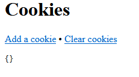
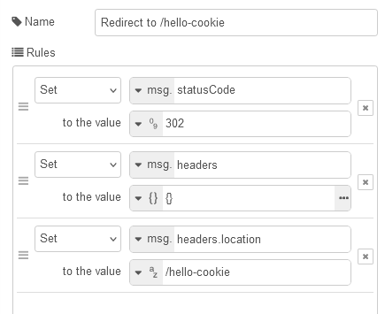
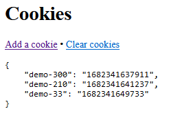

# Робота з cookies в Node-RED

Оигінальний приклад взятий зі статті [Work with cookies](https://cookbook.nodered.org/http/work-with-cookies) деяка інформація отримана з ChatGPT.

## Що таке файли cookie?

Файли cookie - це малий текстовий файл, який зберігається на комп'ютері  користувача при відвідуванні веб-сайту. Файли cookie зазвичай  використовуються для зберігання інформації про користувача, таку як його налаштування, переваги та історію відвідувань, що дозволяє веб-сайту  персоналізувати вміст для конкретного користувача. Файли cookie можуть  бути використані для збору інформації про користувачів, таких як їхній  IP-адреса, браузер та операційна система. Зазвичай файли cookie є  безпечними, але в деяких випадках можуть стати об'єктом зловживання,  тому користувачі повинні бути обережні з тим, яку інформацію вони  дозволяють веб-сайтам збирати за допомогою файлів cookie. 

```mermaid
sequenceDiagram
  participant Client as Клієнт
  participant Server as Сервер
  Client->>+Server: HTTP запит зі значеннями cookie
  Server->>-Client: HTTP відповідь зі значеннями cookie
```

Основні приклади використання файлів cookie:

1. Запам'ятовування налаштувань користувача: файл cookie може містити налаштування, які користувач може встановити на сайті, наприклад, мову і кольорову схему.
2. Авторизація та безпека: файли cookie можуть використовуватися для збереження даних авторизації користувача, щоб він міг залишатися авторизованим під час переходу між сторінками сайту. Крім того, файл cookie може містити унікальний ідентифікатор, який використовується для відстеження дій користувача на сайті.
3. Аналітика: файли cookie можуть містити дані про те, як користувач взаємодіє з сайтом, такі як сторінки, які він переглядає, та час, який він на них проводить. Ці дані можуть бути використані для аналізу поведінки користувачів та для удосконалення сайту.
4. Реклама: файли cookie можуть використовуватися для показу користувачам налаштованої реклами на сайті або на інших сайтах, що відвідує користувач.
5. Збереження кошика: файли cookie можуть використовуватися для збереження товарів у кошику покупця, коли він робить покупки в інтернет-магазині.

На діаграмі нижче зображений приклад взаємодії між веб-клієнтом та веб-сервером через файли cookie для авторизації та захисту.

```mermaid
sequenceDiagram
    participant Client
    participant Server
    Client->>Server: Відправлення запиту
    Server->>Client: Відправлення відповіді з HTTP-статусом 200 та файлом cookie з токеном авторизації
    Client->>Server: Відправлення запиту з файлом cookie з токеном авторизації
    Server->>Client: Перевірка токена та відправлення відповіді на запит
```

Коли веб-клієнт відправляє запит на сервер, сервер відповідає з HTTP-статусом 200 та файлом cookie, який містить токен авторизації. Файл cookie зберігається в браузері веб-клієнта. Після цього, при кожному наступному запиті веб-клієнта, файл cookie автоматично додається до запиту, що дозволяє серверу ідентифікувати користувача та перевірити токен авторизації. Якщо токен дійсний, сервер повертає відповідь на запит. Цей підхід забезпечує безпеку та авторизацію, оскільки токен авторизації генерується сервером і не може бути підроблено або змінено з боку користувача. Також, передача токену через файли cookie забезпечує зручний та ефективний спосіб зберігання та передачі інформації між веб-клієнтом та веб-сервером.

Файли cookie зберігаються на боці клієнта (у браузері або додатку). У  більшості веб-браузерів файли cookie зберігаються в тимчасових файлах  Інтернету або в окремих файлах на жорсткому диску комп'ютера  користувача. Вони можуть бути доступні для інших веб-сторінок, які  належать тому же домену, що й початкова веб-сторінка, яка створила ці  файли cookie. Сервери не можуть отримати файли cookie, що були призначені для сторінок з іншого серверу. Це пов'язано з політикою безпеки браузера, відомою як Same-Origin Policy (SOP). Згідно з цією політикою, JavaScript, запущений на сторінці, може отримувати доступ до даних тільки з того ж самого домену, на якому він запущений. Це означає, що файли cookie, створені на одному домені, не можуть бути прочитані або модифіковані на іншому домені. Це є важливим механізмом безпеки, оскільки забезпечує, що дані користувача не будуть доступні для небажаних сторон.

## Використання cookies в Node-RED

Об'єкт `msg.req.cookies` містить властивості з файлів cookie, які були надіслані в запиті HTTP до вузла `http-in` Node-RED. Основні властивості об'єкта `msg.req.cookies` включають:

- `name`: назва куки
- `value`  (String): значення, яке буде використано для файлу cookie
- `path` (String) : шлях для файлу cookie. За замовчуванням `/`
- `domain` (String): домен, на якому діє куки
- `expires` (Date): термін дії в GMT. Якщо не вказано або встановлено значення 0, створює сеансовий файл cookie
- `maxAge` - (String) дата закінчення терміну дії відносно поточного часу в мілісекундах
- `httpOnly`: куки доступні тільки через HTTP, а не JavaScript
- `secure`: куки можуть бути відправлені тільки за захищеним протоколом HTTPS
- `sameSite`: політика SameSite, яка визначає, коли браузер може відправляти куки у непопередньо запитуваних ресурсах.

Ці властивості дозволяють взаємодіяти з куками та отримувати необхідну інформацію з них. Наприклад, можна перевіряти, чи наявні певні куки, і виконувати певні дії залежно від їх наявності або значень. Наприклад можна отримати значення ключа `sessionId`, який зберігається у файлі куки:

```js
var mySessionId = msg.req.cookies['sessionId'];
```

Щоб установити файл cookie у відповіді, властивість `msg.cookies` має бути встановлена на подібний об’єкт ключ/значення. Значення може бути або рядком для встановлення значення файлу cookie з параметрами за замовчуванням, або може бути об’єктом параметрів. У наступному прикладі встановлюються два файли cookie: один із назвою `name` зі значенням `Nick`, інший — `session` зі значенням `1234` і терміном дії встановлено 15 хвилин.

```js
msg.cookies = {
    name: 'nick',
    session: {
        value: '1234',
        maxAge: 900000
    }
}
```

Щоб видалити файл cookie, установіть для нього значення `null`. Вузол `HTTP Request` прийме властивість `encode : false` у файлі cookie, що дозволить уникнути кодування URL-адреси значення під час надсилання в запиті

```js
msg.cookies = {
  myCookie : {
      Path : "/", 
      value : "ysjLVJA==",
      encode : false
  }
 }
```

## Приклад використання в Node-RED

Нижче розписано як створити потік HTTP, який використовує файли cookie.  Повідомлення, надіслані вузлом `HTTP In`, містять властивість `msg.req.cookies`, яка містить список файлів cookie, встановлених для поточного запиту. Вузол `HTTP Response` використовуватиме властивість `msg.cookies`, щоб встановити або очистити файли cookie. Вузол `HTTP Request` прийме вхідну властивість `msg.cookies`, що містить файли cookie, які будуть надіслані з цим запитом.


Експорт потоку доступний [на сайті](https://cookbook.nodered.org/http/work-with-cookies)

У цьому прикладі наведено три кінцеві точки HTTP:

- `/hello-cookie` повертає сторінку зі списком поточних встановлених файлів cookie
- `/hello-cookie/add` додає новий файл cookie та перенаправляє назад до `/hello-cookie`
- `/hello-cookie/clear` очищає всі файли cookie, створені прикладом, і перенаправляє назад до `/hello-cookie`

При запиті `/hello-cookie` повідмлення проходить через функцію `Format cookies` де записаний наступний код: 

```js
msg.payload = JSON.stringify (msg.req.cookies,null,4);
return msg;
```

Цей фрагмент коду виконує серіалізацію об'єкта cookies, який міститься в властивості `msg.req` об'єкта `msg`. За допомогою методу `JSON.stringify` об'єкт перетворюється в рядок JSON формату, що дозволяє передавати його на наступний вузол вигляді текстового рядка. У даному випадку другий параметр, що визначає функцію, яка замінює значення в об'єкті під час серіалізації вказаний як `null`, тобто значення не будуть замінені, а просто будуть серіалізовані. Третім параметром методу передається значення `4`, що вказує на кількість пробілів для відступів в кожному рівні об'єкта - це дозволяє зробити отриманий рядок більш зрозумілим і легким для читання. Отже, фрагмент коду отримує об'єкт cookies з запиту HTTP в Node-RED, серіалізує його в JSON формат і зберігає у властивості `msg.payload`, який передається далі.

Вузол з іменем `page` (тип `template`) містить шаблон `Mustach` для формування сторінки html, куди виводитиметься два посилання на додавання та видалення cookie, який приходить через `msg.payload`,  а також сам зміст cookie який вставляється через замінник `{{ payload }}`.    

```html
<html>
    <head></head>
    <body>
        <h1>Cookies</h1>
        <p>
        	<a href="hello-cookie/add">Add a cookie</a> &bull; 
        	<a href="hello-cookie/clear">Clear cookies</a>
        </p>
        <pre>{{ payload }}</pre>
    </body>
</html>
```

При першому заходженні на сторінку браузера на `/hello-cookie`,  наприклад `http://127.0.0.1:1880/hello-cookie`, виведеться дана сторінка з посиланнями та пустим змістом cookie.



При натискання на `Add a cookie` запуститься потік, що починається з вузла http-in `/hello-cookie/add`. Він проходить через однойменну функцію, яка містить наступний фрагмент: 

```js
msg.cookies = { }; //ініціалізація обєкту cookies
msg.cookies["demo-"+(Math.floor(Math.random()*1000))] = Date.now();//нова властивість
return msg;
```

Цей фрагмент формує ключ з випадковою назвою і дає йому значення плинної дати та часу. Далі йде обробка вузла `change` з іменем  `Redirect to /hello-cookie` який робить наступні дії:



- виставляє у відповіді статус перенаправлення (302)
- виставляє в `headers.location` значення сторінки `/hello-cookie`

Це по факту зробить перенаправлення, тобто повторний запит на  `/hello-cookie` який виведе поточне значення куків. Таким чином кожне натискання на  `Add a cookie` приведе до добавлення нового ключа та його значення в файли куки, ось наприклад після трьох натискань: 



Виклик `/hello-cookie/clear`  приведе до обробки відповідної функції:

```js
// Знаходить демонстраційні файли cookie та чистить їх
// cookieNames - масив полів куків, які починаються з 'demo-'
var cookieNames = Object.keys(msg.req.cookies).filter(
    function(cookieName) {
        //регулярний вираз: усі поля, що починаються 'demo-' 
        return /^demo-/.test(cookieName); 
    });

msg.cookies = {};
//виконання функції для обробки кожного cookieName з масиву cookieNames 
cookieNames.forEach(function(cookieName) {
    msg.cookies[cookieName] = null; //видалення поля куки
});

return msg;
```

`Object.keys()` повертає масив рядків, що містить імена власних властивостей об'єкта, переданого в якості аргументу, а `filter` - створює новий масив, що містить тільки ті елементи вихідного масиву, які задовольняють умови, вказані у функції зворотного виклику, куди передаються елементи масиву.  Таким чином цей код фільтрує об'єкт `msg.req.cookies`, що містить всі куки, передані з HTTP-запиту до Node-RED, і вибирає тільки ті куки, імена яких починаються з `demo-`. В результаті отримується масив `cookieNames`, який містить імена кукі, що задовольняють цьому критерію. Далі створюється порожній об'єкт `msg.cookies`, в який будуть занесені значення відповідних куків. Потім для кожного з імен куки, що були відфільтровані раніше, встановлюється значення `null` в об'єкті `msg.cookies`. Це означає, що ці куки будуть видалені при відправці відповіді на HTTP-запит. Нарешті, об'єкт `msg` повертається зі зміненим полем `msg.cookies`, що містить тільки куки з відповідними іменами.

Зверніть увагу що саме присвоєння `null` видалятиме ці поля в куках.