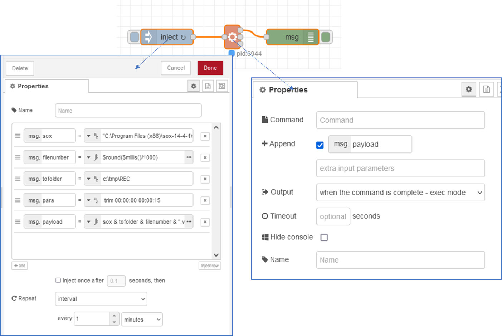

[До збірника задач](README.md)

# Запис аудіо з заданою періодичністю

Автор: Олександр Пупена

## Завдання

Написати фрагмент програми на Node-RED, який має з заданою періодичністю записувати звук з мікрофона в файл. Додаткові вимоги:

- тривалість запису і періодичність є статичними
- файл повинен знаходитися у вказаній директорії
- файл записувати в форматі WAV
- файл повинен називатися за шаблоном "REC0123456789" де цифри вказують на час в форматі UTC в секундах  

## Рішення 1. Використання SoX

Це рішення передбачає використання безкоштовної утиліти [SoX](https://github.com/pupenasan/ProgIngContrSystems/blob/master/Довідники/sounds/SoX.md) яка доступна для різних платформ, як Windows так і Linux. 

### Основна ідея рішення

Для Windows пропонується використовувати версію 14.4.1 так як 14.4.2 на момент перевірки видавала помилку `Sorry, there is no default audio device configured`.  

Утиліта працює в режимі командного рядку. Наприклад, наступний виклик запише звук тривалістю 15 секунд в системі Winodws `c:/tmp/hello.wav` з аудіовходу за замовченням: 

```
 "C:\Program Files (x86)\sox-14-4-1\sox.exe" -d c:\tmp\REC0123456789.wav trim 00:00:00 00:00:15
```

На linux в директорію `/home/pi/Documents` матиме вигляд:

```
sox -d /home/pi/Documents/REC0123456789.wav trim 00:00:00 00:00:15  
```

Отже Node-RED через командний рядок в потрібні моменти часу може викликати подібну команду. Для роботи з командним рядком використовується вбудований вузол [exec](https://pupenasan.github.io/NodeREDGuidUKR/base/1_4_1.html#exec-запуск-команди). На вхід з заданою періодичністю буде подаватися `msg.payload` зі сформованим рядком команди. Рядок команди формуватиметься як конкатинація з:

- частини команди запуску sox з ключем `-d`, береться з `Inject` (наприклад, `"C:\Program Files (x86)\sox-14-4-1\sox.exe" -d `)
- значення розміщення папки з файлами запису та початок назви файл, береться з `Inject`  (наприклад,  `c:\tmp\REC`)
- номер файлу з UTC, розраховується з використанням  [JSONata](https://pupenasan.github.io/NodeREDGuidUKR/jsonata/) , як округлена відмітка часу (в мс) поділена на 1000
- текст `".wav"` який  вказує формат файлу
- хвостовик команди, береться з `Inject` (наприклад, ` trim 00:00:00 00:00:15`)   

### Реалізація



У вузлі `Inject` спочатку формуються усі частини для формування `msg.payload` :

- `sox`: статичний рядок `"C:\Program Files (x86)\sox-14-4-1\sox.exe"  -d `
- `filenumber`: JSONata вираз`$round($millis()/1000)`, який округлює плинне значення часу в мілісекундах поділене на 1000 
- `tofolder`: статичний рядок `c:\tmp\REC`
- `para`: статичний рядок  ` trim 00:00:00 00:00:15`

Нижче значення `payload` розраховується як конкатинація у JSONata усіх частин. 

Експорт фрагменту

```r
[{"id":"65b2caee06fbe98e","type":"debug","z":"7447aa5a9ab85dd5","name":"","active":true,"tosidebar":true,"console":false,"tostatus":false,"complete":"true","targetType":"full","statusVal":"","statusType":"auto","x":410,"y":340,"wires":[]},{"id":"c0ce8fbb50c3eb0e","type":"inject","z":"7447aa5a9ab85dd5","name":"","props":[{"p":"sox","v":"\"C:\\Program Files (x86)\\sox-14-4-1\\sox.exe\"  -d ","vt":"str"},{"p":"filenumber","v":"$round($millis()/1000)","vt":"jsonata"},{"p":"tofolder","v":"c:\\tmp\\REC","vt":"str"},{"p":"para","v":" trim 00:00:00 00:00:15","vt":"str"},{"p":"payload"}],"repeat":"60","crontab":"","once":false,"onceDelay":0.1,"topic":"","payload":"sox & tofolder & filenumber & \".wav\" & para","payloadType":"jsonata","x":170,"y":340,"wires":[["b0e91a61a6a6ca1f"]]},{"id":"b0e91a61a6a6ca1f","type":"exec","z":"7447aa5a9ab85dd5","command":"","addpay":"payload","append":"","useSpawn":"false","timer":"","winHide":false,"oldrc":false,"name":"","x":295,"y":340,"wires":[["65b2caee06fbe98e"],[],[]],"l":false}]
```

