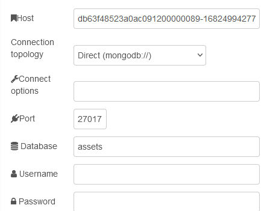
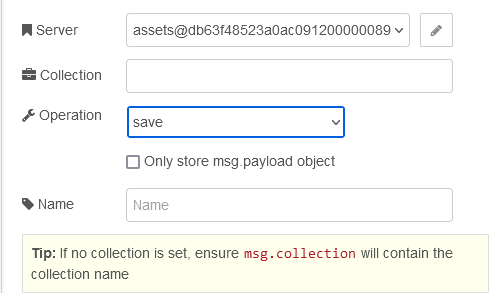

# MongoDB

Вступну інформацю про MongoDB можна почитати за [цим посиланням](https://pupenasan.github.io/ProgIngContrSystems/%D0%94%D0%BE%D0%B2%D1%96%D0%B4%D0%BD%D0%B8%D0%BA%D0%B8/mongodb/).

## node-red-node-mongodb

https://flows.nodered.org/node/node-red-node-mongodb

### mongodb


Вузли для збереження та отримання даних в екземплярі MongoDB, сервер бази даних може бути:

- локальним (`mongodb//:localhost:27017`), 

- віддаленим набором реплік (`mongodb://hostname.network:27017`), 
- кластером (`mongodb://hostnameA.network:27017`,`hostnameB.network:27017`) і кластер списку початкових DNS (`mongodb+srv://clustername.network`).

Перегляньте [документи MongoDB](https://docs.mongodb.com/manual/reference/connection-string/), щоб дізнатися, який метод підключення (хостовий або кластерний) використовувати для вашого екземпляра MongoDB.



**Connect options** – це місце, де ви додаєте додаткові параметри, необхідні для вашого екземпляра MongoDB. Це може включати:

- w=majority
- replicaSet=replset
- authSource=admin

і будь-які інші відповідні параметри – повний набір доступний у [Формат URI рядка підключення — посібник MongoDB](https://docs.mongodb.com/manual/reference/connection-string/). 

Якщо ви підключаєтесь до [IBM Databases for MongoDB](https://cloud.ibm.com/catalog/services/databases-for-mongodb-group), як набір реплік, обов’язково додайте `ssl=true&tlsAllowInvalidCertificates= true ` для **Connect options**.

### Input


Викликає метод MongoDB collection  на основі вибраного оператора.


- `Find` запитує колекцію, використовуючи `msg.payload` як оператор запиту ([query operators](https://www.mongodb.com/docs/manual/reference/operator/query/)) відповідно до функції `.find()`. 

- `Count` повертає підрахунок кількості документів у колекції або відповідності запиту з використанням `msg.payload` як оператора запиту. 
- `Aggregate` надає доступ до конвеєра агрегації за допомогою `msg.payload` як масиву конвеєра. Ви можете встановити метод збору в конфігурації вузла або в `msg.collection`. Встановлення його у вузлі замінить `msg.collection`.

Перегляньте [*Документацію методів collection MongoDB*](http://docs.mongodb.org/manual/reference/method/db.collection.find/) для прикладів.

Результат повертається в `msg.payload`.

#### find

[Деталі](https://pupenasan.github.io/ProgIngContrSystems/%D0%94%D0%BE%D0%B2%D1%96%D0%B4%D0%BD%D0%B8%D0%BA%D0%B8/mongodb/collection_find.html)

`Find` запитує колекцію, використовуючи `msg.payload` як оператор запиту ([query operators](https://www.mongodb.com/docs/manual/reference/operator/query/)) відповідно до функції `.find()`.  За бажанням ви також можете (за допомогою функції) встановити

- `msg.projection` об’єкт для обмеження повернених полів,

- `msg.sort` об’єкт ,

- `msg.limit` number,

- `msg.skip` number.


```js
db.runCommand(
   {
      find: <string>, //Назва колекції або представлення для запиту.
      filter: <document>, //опціонально - Предикат запиту. Якщо не вказано, всі документи в колекції відповідатимуть предикату.
      sort: <document>,//опціонально - Специфікація сортування для впорядкування результатів.
      projection: <document>, //Специфікація проекції, щоб визначити, які поля включити до повернених документів. Див. Проекція та оператори проекції.
      hint: <document or string>,
      skip: <int>,
      limit: <int>,
      batchSize: <int>,
      singleBatch: <bool>,
      comment: <any>,
      maxTimeMS: <int>,
      readConcern: <document>,
      max: <document>,
      min: <document>,
      returnKey: <bool>,
      showRecordId: <bool>,
      tailable: <bool>,
      oplogReplay: <bool>,
      noCursorTimeout: <bool>,
      awaitData: <bool>,
      allowPartialResults: <bool>,
      collation: <document>,
      allowDiskUse : <bool>,
      let: <document> // Added in MongoDB 5.0
   }
)
```


### Output


Простий вихідний вузол MongoDB. Може зберігати, вставляти, оновлювати та видаляти об’єкти з вибраної колекції.



MongoDB приймає лише об’єкти. Збереження та вставлення можуть зберігати `msg` або `msg.payload`. Якщо вибрано `msg.payload`, він має містити об’єкт. Якщо ні, він буде загорнутий в об’єкт із назвою payload.

- `Save` оновить існуючий об'єкт або вставить новий об'єкт, якщо він ще не існує.

- `Insert` вставить новий об'єкт.

- `Update` змінить існуючий об'єкт або об'єкти. Запит на вибір об’єктів для оновлення використовує `msg.query`, а оновлення елемента використовує `msg.payload`. Оновлення може додати об’єкт, якщо він не існує, або оновити кілька об’єктів.

- `Remove` видаляє об’єкти, які відповідають запиту, переданому в `msg.payload`. Пустий запит видалить *усі об’єкти* в колекції.

Ви можете встановити метод collection в конфігурації вузла або в `msg.collection`. Встановлення його у вузлі замінить `msg.collection`.

За замовчуванням MongoDB створює властивість `msg._id` як первинний ключ, тому повторне введення того самого `msg` призведе до багатьох записів бази даних. Якщо це НЕ бажана поведінка - тобто. ви хочете перезаписати повторювані записи, тоді ви повинні встановити властивість `msg._id` як константу за допомогою попереднього вузла функції. Це потрібно робити на правильному рівні. Якщо записується лише `msg.payload`, тоді корисне навантаження має містити властивість `_id`. Якщо писати весь об’єкт `msg`, він повинен містити властивість `_id`.

Це може бути унікальна константа, або ви можете створити її на основі іншої властивості повідомлення.

Наразі ми взагалі не обмежуємо розмір колекції...

#### update

Замінює існуючий об'єкт або об'єкти. Запит на вибір об’єктів для оновлення використовує `msg.query`, а оновлення елемента використовує `msg.payload`. Оновлення може додати об’єкт, якщо він не існує, або оновити кілька об’єктів.
