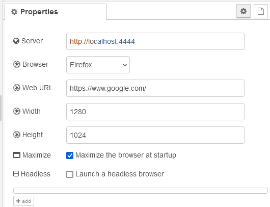

# node-red-contrib-simple-webdriver

https://flows.nodered.org/node/node-red-contrib-simple-webdriver

Вузли Simplewebdriver для Node-Red дозволяють автоматизувати веб-браузер і базується на основі [Selenium-Webdriver](https://www.selenium.dev/documentation/) API. Базується на бібліотеці [node-red-contrib-selenium-webdriver](https://flows.nodered.org/node/node-red-contrib-selenium-webdriver) і розгалужено з node-red-contrib-selenium-wd2, його було переписано на Typescript, щоб полегшити його обслуговування, покращити загальну стабільність і трохи оновити набір функцій.

Щоб використовувати node-red-contrib-simple-webdriver, ви повинні виконати таку передумову:

- Встановіть webdriver для Вашого барузера [звідси](https://www.selenium.dev/documentation/webdriver/getting_started/install_drivers/#quick-reference)

- Встановіть бібіліотеку node.js для webdriver для Вашого барузера chromedriver, geckodriver, edgedriver або safaridriver: 

`npm install -g chromedriver` 

## Загальне

Вам завжди доведеться починати з вузла `open-browser`.

Більшість вузлів забезпечать два виходи: успішний і невдалий.

- Успішний вихід використовується, якщо виконання вузла є успішним і якщо виконання потоку може продовжуватися (тобто драйвер все ще в порядку)
- Виведення помилок використовується у випадку "м'якої" помилки (неможливо знайти елемент або невірне очікуване значення). Він спрямований на підтримку нефункціональних випадків використання. (Якщо щось не можна клацнути або знайти)
- Помилка запускається у разі «критичної» помилки (тобто драйвер більше не можна використовувати). Це означає, що в цьому випадку вам доведеться впоратися з очищенням на стороні простого веб-драйвера.

Більшість властивостей вузлів підтримують спрощений синтаксис moustache для отримання значення безпосередньо з об’єкта `msg` (наприклад, `{{msg.property}}`) або середовища (наприклад `{{env.property}}`).

## open browser



Створіть екземпляр Simple Webdriver і підключіть його до Selenium Server (Сервер). Не потребує входів. Цей вузол використовується для створення Webdriver, який є передумовою для всіх інших вузлів WD2.

- Server: вкажіть URL-адресу Selenium Server. Це може бути локальний хост або віддалений сервер Selenium.
- Browser: вкажіть веб-браузер, який ви хочете використовувати, наприклад [Chrome, Firefox тощо]
- Web URL: вкажіть веб-сторінку для запуску, яка буде завантажена під час запуску браузера.
- Maximize: запустити розгорнутий браузер. 
- Headless: запустіть браузер без заголовка.

Вихід:

```json
{...
 "browser":{
     "session":"90f6957b-dc9f-466f-a070-ca1eeebc2c6b",
     "_webdriver":{
         "_serverURL":"http://localhost:4444/",
         "_api":{}
     },
     "_closed":false,
     "browserType":"firefox",
     "timeouts":{
         "implicit":0,
         "pageLoad":300000,
         "script":30000}
 }
}
```


## close browser

Закрийте веб-браузер, відкритий вузлом відкритого браузера, і завершіть сеанс selenium.

Входи:

- browser: об’єкт сеансу браузера, необхідний для виконання дій перегляду.
- waitFor (msec)number: час паузи перед запуском запиту на закриття.


## set value


Цей вузол використовується для встановлення значення вибраного елемента. Установіть значення для атрибута `value` `msg.element` або після очікування, поки знайдеться очікуваний елемент.

**Налаштування**:

За винятком першого вибору, останнє повідомлення матиме властивість `msg.last` зі значенням `true`

- `Value`: specify the keys which must be sent to the browser. The `msg.value` will be overrided by the `Value` field if set.
- `By`: (if set) specify the way to find an element by selector. The `msg.selector` will be overrided by the `By` field if set.
- `Target`: specify the selector's value to lookup. The `msg.target` will be overrided by the `Target` field if set.
- `Timeout`: specify the timeout during lookup operation. The `msg.timeout` will be overrided by the `Timeout` field if set.
- `Wait For`: specify the time to wait before looking up. The `msg.waitFor` will be overrided by the `Wait For` field if set

- `Mode`: Режим дозволяє визначити поведінку вузла, якщо вибрано кілька елементів.

  - First (default) : лише перший елемент використовується вузлом.

  - All (continue if error) / each generate a message: усі елементи будуть використані вузлом. Для кожного елемента буде створено вихідне повідомлення.

  - All (stop at first error) / each generate a message :  усі елементи використовуватимуться вузлом, доки не буде виявлено помилку. Для кожного елемента буде створено вихідне повідомлення (до кінця або помилки).

  - All (continue if error) / last generate a message: усі елементи використовуватимуться вузлом. Вихідне повідомлення буде згенеровано лише для останнього елемента.

  - All (stop at first error) / last generate a message: усі елементи використовуватимуться вузлом, доки не буде виявлено помилку. Вихідне повідомлення буде згенеровано лише для останнього елемента (або першої виявленої помилки).

**Входи**

- browser: the browser session object required to execute browsing actions.
- element: the Element object required to execute the required action.
- value (string):  the keys which must be sent to the browser element.
- selector (string):  the way to find an element (can be id, name, link, xpath, tagName, className, linkText, css).
- target (string):  the name of the target to find.
- timeout (msec) (number): the timeout value of the find request.
- waitFor (msec) (number):  the pause time before launching the node action.

- 